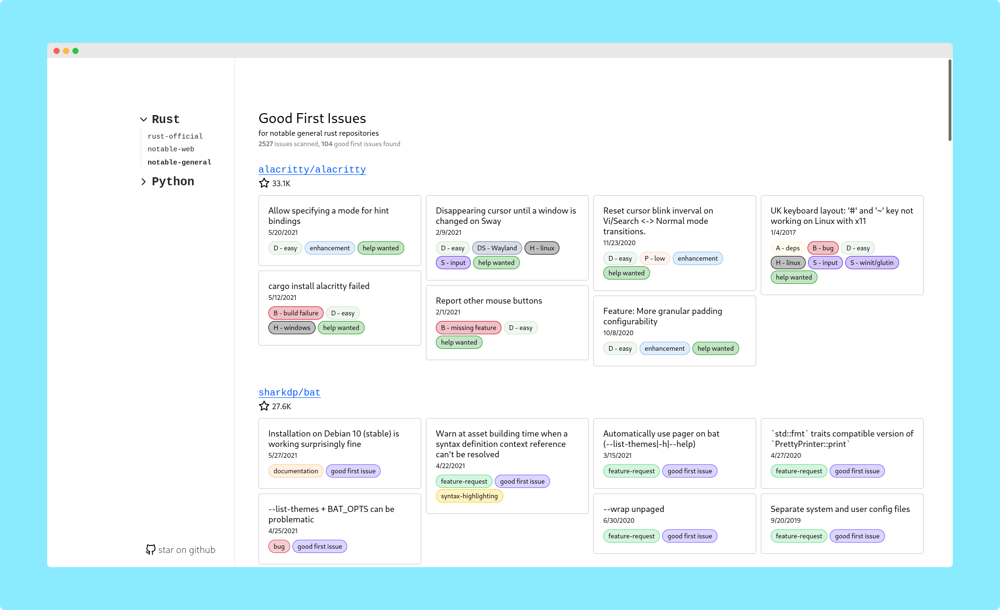

    <h2>issuebase</h2>
    <b>a site to explore good-first-issues on notable github repositories</b>
     
     
    
     
     
    live at <a href="https://issuebase.vercel.app"><b>issuebase.vercel.app</b></a>

 
 

Ever wanted to contribute to a recognized project on GitHub?
**Issuebase can help**. It lists good first issues in many projects across many languages.

The site is completely free to use.

 

### Contributing

Contributors to issuebase are welcome. Feel free to open a pull request 
adding more repositories to the issuebase manifest. 
[More info here](./add-project.md).
